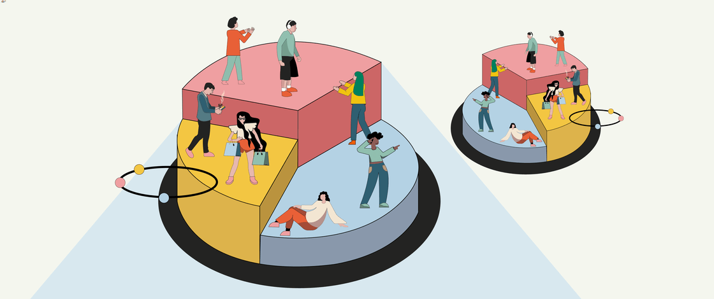

# Customer Segmentation Analysis

  

## Overview

Customer segmentation is a fundamental marketing strategy that helps businesses understand different customer groups and tailor their campaigns accordingly.

This project analyzes customer demographics, income, spending habits, purchasing behavior, and promotional responses to identify distinct customer segments using Machine Learning techniques.

The goal is to uncover hidden patterns in customer behavior and provide actionable business insights that can improve customer targeting, retention, and marketing effectiveness.

---

## Business Problem

Businesses often treat all customers similarly, resulting in inefficient marketing campaigns and lower customer engagement.

This project addresses the following questions:

- Who are the most valuable customers?
- Which customers are most responsive to promotions?
- How do income and family structure influence spending behavior?
- Which customer groups should receive different marketing strategies?

---

## Dataset

The dataset contains customer information related to:

- Demographics
  - Age
  - Education
  - Marital Status

- Financial Information
  - Annual Income

- Purchase Behavior
  - Spending across multiple product categories
  - Purchase channels

- Marketing Engagement
  - Campaign acceptance
  - Promotional responses

- Household Information
  - Number of children

---

## Tech Stack

- Python
- Pandas
- NumPy
- Matplotlib
- Seaborn
- Plotly
- Scikit-Learn
- Yellowbrick

---

## Project Workflow

### 1. Data Preprocessing

- Handled missing values
- Converted date features
- Performed feature engineering
- Encoded categorical variables
- Standardized numerical features

### 2. Exploratory Data Analysis (EDA)

Analyzed:

- Age distribution
- Income distribution
- Spending patterns
- Promotion acceptance trends
- Correlation among features

### 3. Dimensionality Reduction

Applied Principal Component Analysis (PCA) to reduce feature dimensionality while retaining maximum information.

### 4. Customer Segmentation

Used K-Means Clustering to identify distinct customer groups.

The Elbow Method was used to determine the optimal number of clusters.

**Optimal Number of Clusters: 4**

---

## Customer Segments Identified

### Cluster 0 — High Value Customers

**Characteristics**

- Highest spending customers
- Strongest response to marketing campaigns
- Mostly customers without children
- Premium customer segment

**Business Opportunity**

- Loyalty programs
- Premium memberships
- Exclusive product launches

---

### Cluster 1 — Low Engagement Customers

**Characteristics**

- Low spending behavior
- Minimal campaign response
- Mostly customers with no or one child

**Business Opportunity**

- Discount campaigns
- Cashback offers
- Customer retention initiatives

---

### Cluster 2 — Family-Oriented Customers

**Characteristics**

- Mostly customers with two children
- Lower overall spending
- Low promotional engagement

**Business Opportunity**

- Family bundles
- Seasonal discounts
- Value-focused marketing campaigns

---

### Cluster 3 — Growth Potential Customers

**Characteristics**

- Moderate to high spending
- Better campaign response than Clusters 1 and 2
- Mostly customers with one child

**Business Opportunity**

- Cross-selling
- Upselling
- Personalized recommendations

---

## Key Insights

### Spending Behavior

- Customer spending increases significantly with income.
- High-income customers contribute disproportionately to overall revenue.
- Customers without children tend to spend more than customers with larger families.

### Promotion Response

- The majority of customers have never accepted a promotional campaign.
- Cluster 0 shows the highest promotional engagement.
- Highly promotion-responsive customers represent a relatively small segment.

### Customer Value

- Cluster 0 represents the most valuable customer group.
- Cluster 3 represents customers with strong growth potential.
- Clusters 1 and 2 require targeted engagement strategies to improve conversion.

---

## Business Recommendations

| Cluster | Recommended Strategy |
|----------|---------------------|
| Cluster 0 | Loyalty Programs & Premium Offers |
| Cluster 1 | Retention Campaigns & Discounts |
| Cluster 2 | Family-Oriented Promotions |
| Cluster 3 | Personalized Upselling & Cross-Selling |

---

## Results

The analysis successfully segmented customers into four meaningful groups with distinct behavioral characteristics.

These insights can help businesses:

- Improve customer targeting
- Increase campaign effectiveness
- Enhance customer retention
- Optimize marketing expenditure
- Deliver personalized customer experiences

---

## Author

### Pritish Barupal

B.Tech, Metallurgical & Materials Engineering  
National Institute of Technology Raipur

